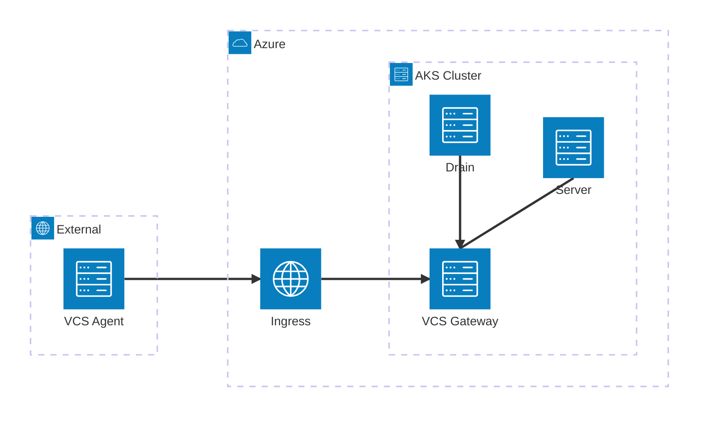

# With VCS Gateway Example

This example demonstrates how to deploy Spacelift Self-Hosted on AKS with the VCS Gateway enabled.

The VCS Gateway allows you to connect [remote VCS agents](https://docs.spacelift.io/concepts/vcs-agent-pools.html) to Spacelift, enabling integration with VCS providers that are not directly accessible from the Spacelift server.

## Architecture

The VCS Gateway service exposes two listeners:

- **gRPC (port 1984)** - External endpoint for [remote VCS Agents](https://docs.spacelift.io/concepts/vcs-agent-pools.html), exposed via an Ingress
- **HTTP (port 1985)** - Internal endpoint for Spacelift services (server, drain) via pod-to-pod communication



| Connection                        | Protocol | Port | Path                                                      |
| --------------------------------- | -------- | ---- | --------------------------------------------------------- |
| VCS Agent → Ingress → VCS Gateway | gRPC     | 1984 | `vcs-gateway.example.com:443` (TLS terminated at Ingress) |
| Server → VCS Gateway              | HTTP     | 1985 | `http://<pod-ip>:1985` (pod-to-pod)                       |
| Drain → VCS Gateway               | HTTP     | 1985 | `http://<pod-ip>:1985` (pod-to-pod)                       |

## Prerequisites

- cert-manager installed in the cluster with a `letsencrypt-prod` ClusterIssuer configured

## DNS Configuration

Both the Spacelift server domain and the VCS Gateway domain should point to the **same public IP address** (`$PUBLIC_IP_ADDRESS` from the module outputs). The nginx ingress controller uses [host-based routing](https://kubernetes.github.io/ingress-nginx/user-guide/basic-usage/) to direct traffic to the correct backend service based on the hostname in the request.

```
spacelift.example.com      → A record → $PUBLIC_IP_ADDRESS
vcs-gateway.example.com    → A record → $PUBLIC_IP_ADDRESS
```

When a request arrives, nginx examines the `Host` header and routes it accordingly:
- Requests to `spacelift.example.com` → Spacelift server (HTTP)
- Requests to `vcs-gateway.example.com` → VCS Gateway (gRPC)

## Usage

```hcl
module "spacelift" {
  source = "github.com/spacelift-io/terraform-azure-spacelift-selfhosted"
  # Configurations omitted for brevity

  vcs_gateway_domain = "vcs-gateway.example.com"
}
```

## Inputs

| Name               | Description                                                         | Type   | Required |
| ------------------ | ------------------------------------------------------------------- | ------ | -------- |
| vcs_gateway_domain | The domain for the VCS Gateway external endpoint (without protocol) | string | yes      |

## Next Steps

After deploying the infrastructure:

1. Configure DNS A records for both `app_domain` and `vcs_gateway_domain` pointing to `$PUBLIC_IP_ADDRESS`. The nginx ingress controller will route traffic based on the hostname.
2. [Create a VCS Agent Pool](https://docs.spacelift.io/self-hosted/latest/concepts/vcs-agent-pools.html#create-the-vcs-agent-pool) in the Spacelift UI
3. [Configure direct network access](https://docs.spacelift.io/self-hosted/latest/concepts/vcs-agent-pools.html#configure-direct-network-access) on your private workers using the `SPACELIFT_PRIVATEVCS_MAPPING_*` environment variables
